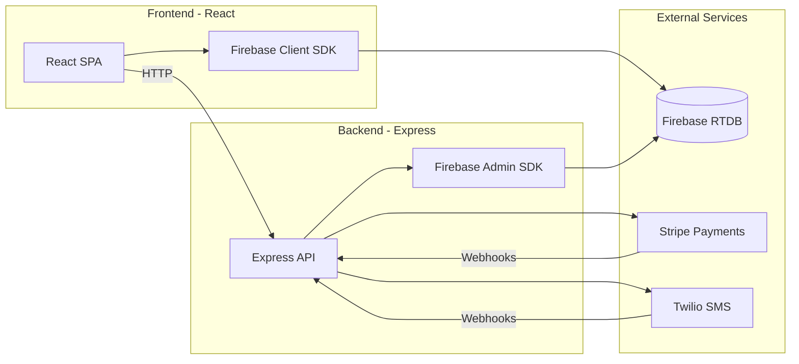

<p align="center">
  
</p>

<p align="center">
  <strong>A subscription-based donation allocation platform</strong><br/>
  <em>Built 2019–2020 &middot; Modernized for showcase</em>
</p>

---

## What is Giveassist?


**Giveassist** was a real, operational nonprofit platform that made philanthropy effortless. The core idea: make donating so cheap, so easy, and so automatic that there was no excuse for anyone not to be a donor.

Users subscribed to one of three inexpensive monthly plans ($2.99, $4.99, or a custom amount). Each month, the Giveassist team hand-selected three pressing causes. Users voted — via the web app or SMS — on which cause should receive that month's pooled donations. At month's end, the winning cause received the funds. **99.5% of every dollar went directly to the cause**, with only a sliver covering operating costs.

The platform had real, paying customers. It ran from mid-2019 through early 2021 before being sunset. All donations were made, all obligations fulfilled.

## How It Worked

```
 ┌─────────────────────────────────────────────────────────────┐
 │                    The Giveassist Cycle                     │
 │                                                             │
 │   1. Staff selects 3 causes for the month                   │
 │   2. Users notified via SMS and email                       │
 │   3. Users vote on the platform or via text message         │
 │   4. Stripe auto-charges subscriptions monthly              │
 │   5. Winning cause receives the pooled donations            │
 │   6. Repeat.                                                │
 └─────────────────────────────────────────────────────────────┘
```

**Subscription Tiers:**
| Plan | Cost | Philosophy |
|------|------|-----------|
| PY | $2.99/mo | The entry point — anyone can afford this |
| PX | $4.99/mo | A small step up for those who want to give more |
| PZ | Custom | Choose your own whole-dollar amount |

The pricing cap was intentional: we didn't want a $400/month donor making a $1/month donor feel insignificant. Everyone on the same playing field.

## Architecture



The backend receives Stripe webhooks for charge events and Twilio webhooks for SMS votes. A monthly rollover process is triggered by Stripe's `payout.created` event, which tallies votes, records the winner, advances to the next event, and notifies all users via SMS.

## Tech Stack

| Layer | Original (2019) | Current (Modernized) |
|-------|-----------------|---------------------|
| **Frontend** | React 16, CRA, React Router 5 | React 18, Vite, React Router 6 |
| **Backend** | Node 10, Express 4.17 | Node 20, Express 4.21 |
| **Database** | Firebase RTDB | Firebase RTDB (unchanged) |
| **Payments** | Stripe 6.x | Stripe 17.x |
| **SMS** | Twilio 3.x | Twilio 5.x |
| **Monorepo** | Manual scripts | Turborepo |
| **Containerization** | Docker (Node 10) | Docker (Node 20) |

## Design Decisions

A few engineering choices worth highlighting — some were ahead of their time, some show where I was as an engineer:

- **Custom `Link` database abstraction layer.** Both frontend and backend share a `Link` class that wraps Firebase refs with a fluent API (`DB.User_info(uid).fetch()`, `DB.Event_totalDonated(eid).set(value)`). This kept database paths centralized and made queries readable across the entire codebase.

- **Phased customer charge processing.** When Stripe fires a `charge.succeeded` webhook, the backend processes it through 8 sequential phases — each one fetching, validating, and incrementing data atomically with logging at every step. Over-engineered? Maybe. But it made debugging payment issues trivial.

- **Event bus for cross-component communication.** Before React Context was widespread, I built a simple pub/sub event system (`service.js`) for auth state propagation. Components subscribe with IDs, enabling targeted updates without prop drilling.

- **Sequential form validation UX.** The signup form progressively reveals fields as each previous field validates. Fields lock when their predecessors are invalidated. The `InputForm` and `InputComponent` pair handles this generically with validation callbacks.

- **CSS custom properties for theming.** In 2019, CSS variables weren't the norm they are now. The frontend uses a custom property system (`--primary`, `--secondary`, `--tertiary`, `--quartiary`) for consistent theming.

- **SMS voting via Twilio webhooks.** Users could text a number (1, 2, or 3) to cast their vote. Included spam detection that would alert the admin if a number sent more than 8 messages.

- **Factory function pattern for UI composition.** Components like `Navbar`, `Vote`, `Analytics`, and `BasicInfo` use factory functions rather than traditional React components — a pattern choice that kept the dashboard composition in `UISensei` clean and readable.

## Running Locally

The project runs in **demo mode** by default — no Firebase, Stripe, or Twilio credentials needed. All services are stubbed with realistic mock data.

### Prerequisites

- Node.js 20+ (see `.nvmrc`)
- npm 10+

### Quick Start

```bash
# Install all dependencies (root + workspaces)
npm install

# Start both frontend and backend in dev mode
npx turbo dev
```

- **Frontend:** http://localhost:3000
- **Backend:** http://localhost:1234

### With Docker

```bash
docker compose up
```

### Production Mode

To run with real services, copy the `.env.example` files and set `DEMO_MODE=false` with your actual credentials:

```bash
cp backend/.env.example backend/.env
cp frontend/.env.example frontend/.env
# Edit both .env files with your credentials
```

## Project Structure

```
giveassist/
├── backend/
│   ├── index.js              Express server & API routes
│   ├── ProjectInfo.js         Service factory (real vs demo)
│   ├── DBLinks.js             Database abstraction layer (Link class)
│   ├── util.js                Core business logic
│   ├── plans.js               Subscription plan definitions
│   ├── helpers.js             Validation utilities
│   ├── logging.js             Colored console logging
│   ├── SMS.js                 Twilio integration
│   ├── CreateEvent.js         Event creation logic
│   └── demo/                  Mock services for demo mode
├── frontend/
│   ├── src/
│   │   ├── index.jsx          App entry point & routing
│   │   ├── Helper-Files/      Firebase, DB abstraction, event bus, config
│   │   ├── Views/
│   │   │   ├── Pages/         Intro, Login, SignUp, Dashboard
│   │   │   └── Modules/       Vote, Analytics, Forms, Payments, Particles
│   │   ├── styles/            Global CSS & transitions
│   │   ├── images/            Icons & assets
│   │   └── demo/              Mock Firebase & data for demo mode
│   └── vite.config.js         Vite build config
├── turbo.json                 Turborepo pipeline
├── docker-compose.yml         Container orchestration
└── package.json               Workspace root
```

## Project Timeline

| Date | Milestone |
|------|-----------|
| Dec 2018 | Initial commit — project inception |
| Jan 2019 | Beta 1.0 — core platform functional |
| Jul 2019 | **"WE LIVE"** — launched to real users |
| Aug 2019 | Stripe payments, Twilio SMS voting integrated |
| Apr 2020 | Platform 2.0 — major backend refactor, new UI |
| Oct 2020 | Final active development |
| Early 2021 | Platform sunset — all donations fulfilled |
| 2026 | Modernized as a portfolio showcase |

## Retrospective

**What went well:**
- The subscription model worked exactly as theorized. Users signed up and donations happened automatically from there.
- The voting mechanic created genuine engagement — people cared about which cause won.
- Building everything end-to-end (frontend, backend, payments, SMS, design, financial modeling) was an incredible learning experience.

**What I'd do differently today:**
- **TypeScript everywhere.** The entire codebase would benefit from type safety, especially the Firebase data layer with its abbreviated field names.
- **Firestore over Realtime Database.** Better querying, offline support, and more natural data modeling.
- **Proper state management.** The custom event bus worked, but React Context or a state library would be more maintainable.
- **Infrastructure as Code.** Terraform or Pulumi for the Firebase project, Stripe products, and deployment pipeline.
- **CI/CD pipeline.** Automated testing and deployment instead of manual Heroku pushes.
- **Better separation of the admin flow.** Event creation was a separate HTML form with a hardcoded key. A proper admin panel would have been worth the investment.

---

<p align="center">
  
  <br/>
  <em>Built by <a href="https://github.com/ryancocuzzo">Ryan Cocuzzo</a></em>
</p>
